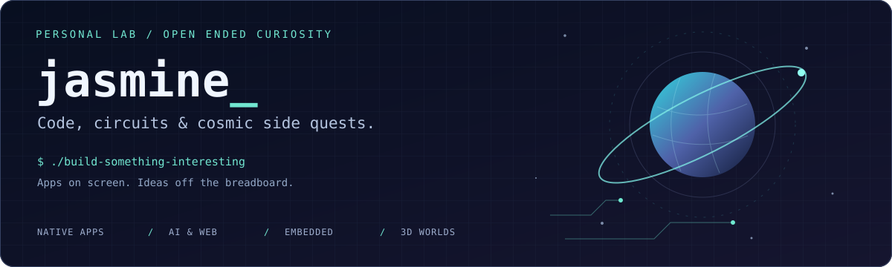

[](https://www.marin9090.cn/)

# Hey, I'm jasmine.

**Software tinkerer. Hardware nerd. Collector of increasingly complicated side quests.**

I build native apps, web experiences, AI tools, and things with circuit boards. Somewhere between a SwiftUI view, a Python script, an ESP32, and a shader, another idea usually happens.

Creator of **[Tide](https://tide.marin9090.cn/)** · Contributor to **[OpenWorker](https://github.com/andrewyng/openworker)** · Keeper of **[this small corner of the universe](https://www.marin9090.cn/)**

[Website](https://www.marin9090.cn/) · [Journal](https://www.marin9090.cn/blog/) · [Email](mailto:marin9090@foxmail.com) · [Pull requests](https://github.com/andrewyng/openworker/pulls?q=is%3Apr+author%3Ajasmine889966)

```text
jasmine@lab:~$ cat interests.conf

interfaces   = native apps, thoughtful motion, one last pixel of padding
intelligence = agents, local models, tools that do something useful
hardware     = ESP32, e-paper, circuits, UAVs, telemetry
worlds       = space, shaders, 3D scenes, cinematic side quests
home         = music, NAS, automation, small quality-of-life upgrades
exit_plan    = finish this project, then relax
known_issue  = the next project already exists
```

Usually trimming pixels and tweaking `padding`. Occasionally, your code's resident bug assassin. If the logs turn red at midnight: terminal open, sleeves up, find the cause. My brain may forget yesterday's code. My hands and cache tend to remember.

## 🚀 Things I've built

### Tide · Time, with a little more meaning

An iOS app for countdowns, elapsed time, subscription renewals, and habits. Built around native interactions, local storage, and optional iCloud sync.

`Swift` `SwiftUI` `SwiftData` `WidgetKit` `ActivityKit` `CloudKit`

[Explore the app](https://tide.marin9090.cn/) · [App Store](https://apps.apple.com/app/id6777127402) · [TestFlight](https://testflight.apple.com/join/HV4ZBrjR)

### DeepSeek Monitor · Keep an eye on the tokens

A native macOS menu bar and desktop app for DeepSeek balance, token usage, costs, service status, and local alerts. For the part of the AI experiment where you wonder where the tokens went.

`Swift` `SwiftUI` `AppKit` `Swift Charts` `macOS`

[Source, screenshots & documentation](https://github.com/jasmine889966/DeepSeekMonitor)

### My corner of the universe · A website with side quests

A personal website that grew planets, orbital views, custom shaders, cinematic scenes, and interactive worlds. Three.js is a dangerous thing to give someone who was only going to make a landing page.

`TypeScript` `Three.js` `GLSL` `Vite` `Typecho`

[Enter the site](https://www.marin9090.cn/) · [Explore Earth](https://www.marin9090.cn/explore/earth/) · [Visit Moonlit City](https://www.marin9090.cn/explore/moonlit-city/) · [Read the journal](https://www.marin9090.cn/blog/)

## 🧩 Open source, with the sleeves rolled up

I contribute to [OpenWorker](https://github.com/andrewyng/openworker), working on multilingual interfaces and the experience of using AI tools.

**Merged upstream:** [English & Simplified Chinese GUI internationalization — #127](https://github.com/andrewyng/openworker/pull/127).

My submitted PRs also cover approval intent analysis, connector work, model compatibility, and language-aware session titles. [Follow the individual PRs for their current status.](https://github.com/andrewyng/openworker/pulls?q=is%3Apr+author%3Ajasmine889966)

## 🛠 The toolbox

Different projects call for different tools. This is the working collection: from Apple frameworks and web interfaces to firmware, telemetry, and 3D animation.

| Area | Technologies & tools |
| --- | --- |
| Languages | Swift · TypeScript · JavaScript · Python · C / C++ · Rust · Go · PHP · SQL |
| Apple apps & persistence | SwiftUI · UIKit / AppKit interop · SwiftData · CloudKit · Swift Package Manager |
| Apple system integrations | HealthKit · WidgetKit · ActivityKit / Live Activities · App Intents · AlarmKit · WeatherKit · MapKit · Core Location · AVFoundation |
| Web interfaces | Vue · React · Next.js · Vite · Pinia · Tailwind CSS · TDesign · Ant Design |
| Design & visual thinking | Figma · Design tokens · Affinity Designer · draw.io · Flow diagrams |
| Graphics & visualization | Three.js · WebGL · GLSL shaders · ECharts · Swift Charts · Interactive 3D scenes |
| 3D & technical animation | Blender · Python / bpy · CAD-to-Blender workflows · Materials · Keyframe animation · Exploded assembly visualization |
| Mini Programs | Native WeChat Mini Programs · uni-app · TDesign Mini Program · WeChat Cloud Development |
| Backend & APIs | FastAPI · Pydantic · Node.js · Express · PHP · REST APIs · WebSockets |
| Storage & data processing | MySQL · MongoDB / Mongoose · SQLite · SQLAlchemy · pandas |
| AI & automation | LLM API integration · AI agents · MCP clients & servers · Tool approvals · Browser automation · Data collection workflows |
| Cross-platform desktop | Tauri / Rust · Wails / Go · Qt / QML / C++ · Python sidecars |
| Embedded & electronics | ESP32 · ESP-IDF · Arduino · BLE · I2C · E-paper displays · KiCad |
| UAV & telemetry | ArduPilot · QGroundControl · MAVLink · Ground-control interfaces · Flight-log analysis |
| Testing & delivery | XCTest · Swift Testing · pytest · Vitest · Playwright · Git · CMake · Nginx · Shell scripting |
| Localization & content | i18next · vue-i18n · Apple String Catalogs · Typecho · VitePress |

## 🔬 Between the code and the workbench

### From CAD to moving parts

I work with CAD assets and Blender scenes, using Python to drive materials, keyframes, and exploded assembly animations. Turning an object into a visual explanation is its own kind of engineering.

`Blender` `Python / bpy` `STEP` `STL` `3MF` `Technical visualization`

Shapr3D, FreeCAD, and Bambu Studio are also in my exploration toolkit for modeling and print preparation.

### Small boards, real-world feedback

ESP32 experiments, e-paper displays, BLE, I2C, flight telemetry, and ground-control interfaces. I like the point where a change in code turns into a change on a screen, a board, or a device.

`ESP-IDF` `Arduino` `C / C++` `MAVLink` `ArduPilot` `QGroundControl`

### AI that gets out of the chat box

Agents, MCP integrations, tool permissions, browser automation, and local-model experiments. I'm interested in the plumbing as much as the prompt: how a model reaches a tool, gets permission, handles failure, and completes a useful task.

`Python` `MCP` `LLM APIs` `LM Studio` `AI coding tools`

### Pixels, diagrams, and the last 1%

Figma for interface structure and design tokens. Affinity Designer for visual assets. draw.io for explaining how a workflow fits together. The Affinity suite, Icon Composer, and tldraw leave plenty more room to experiment.

The tiny details count: empty states, translations, loading behavior, keyboard interactions, and the difference between an animation that moves and one that feels right.

## 🪐 Off-duty, still tinkering

| Rabbit hole | Why I keep going back |
| --- | --- |
| Space & sci-fi | Planets, orbital views, atmospheric lighting, and worlds you can wander through. A personal website can absolutely need a space station. |
| 3D & physical making | Models, assemblies, print preparation, electronics, and the satisfying overlap between digital and physical things. |
| Music & audio | A well-kept music library, good sound, and a NAS that keeps the collection within reach. |
| Home automation | Home Assistant experiments and small changes that make everyday devices a little more useful. |
| Games & interactive worlds | Cinematic openings, little challenges, and the occasional boss fight hidden inside a side project. |
| Everyday tools | Time, habits, activity, and community workflows. Repeated friction tends to become a project idea. |

## ⚙️ How this lab runs

- **Build the whole journey.** The happy path, the empty state, the failure, and the way back.
- **Keep control visible.** Local storage where it makes sense, clear permissions, and understandable tool approvals.
- **Test what matters.** Real interactions, meaningful edge cases, and a result you can actually use.
- **Polish the experience.** Native behavior, good translations, thoughtful motion, and yes, the `padding`.
- **Keep the curiosity.** There's usually another framework to explore, a board to try, or a tiny inconvenience to automate.

---

**Got an interesting bug, a strange little device, or a side project that got out of hand?**  
[Say hello](mailto:marin9090@foxmail.com). We'll probably have something to talk about.

*Exploring the universe. Creating with code.*
